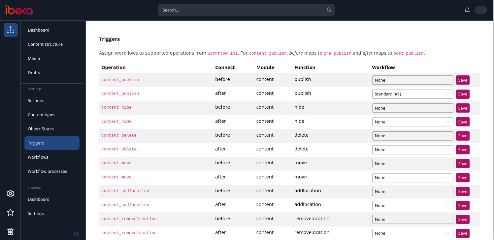

# Ibexa Legacy Workflow

Ports eZ Publish legacy `kernel/workflow` and `kernel/trigger` to **Ibexa DXP 4.x** using **public Repository APIs only** — no edits under `vendor/ibexa`, no legacy `ezworkflow*` tables.

**Author:** Thiago Campos Viana — [@haeretici on X](https://x.com/haeretici) · [YouTube: tcviana](https://www.youtube.com/tcviana)

## What you get

- **Admin UI** under **Settings**: Triggers, Workflows, Workflow processes
- **13 content operations** wired to Ibexa before/after events (publish, hide, show, delete, move, locations, swap, priority, translations, object state, section)
- **Built-in legacy event types**: `event_ezapprove`, `event_ezwaituntildate`, `event_ezmultiplexer`, `event_ezfinishuserregister`
- **Persistence** in `ibexa_setting` by default (optional YAML backend for tests)
- **12 sample after bundles** — one per operation — for isolated testing and log inspection
- **1 consolidated before bundle** — all twelve before-action event types in a single bundle (`OneForAllBeforeWorkflowBundle`)

The `legacy/` directory is read-only reference (original kernel + `workflow.ini`). See **[SUPPORTED.md](SUPPORTED.md)** for the full scope map.

## Admin: Triggers screen

Assign workflows to **before** (`pre_{function}`) and **after** (`post_{function}`) hooks per operation:



Example: `content_publish` → **before** runs `pre_publish`, **after** runs `post_publish`. The matrix lists every operation in `ibexa_legacy_workflow.available_operations`.

## Main bundle: `LegacyWorkflowBundle`

| Item | Value |
|------|--------|
| Namespace | `Haeretici\LegacyWorkflowBundle` |
| Config alias | `ibexa_legacy_workflow` |
| Role | Workflow engine, storage, admin CRUD, event subscribers |

### Core pieces

| Component | Purpose |
|-----------|---------|
| `TriggerRunner` / `WorkflowProcessRunner` | Executes workflow event sequences for a trigger |
| `PublishWorkflowSubscriber` | Publish → `pre_publish` / `post_publish` |
| `ContentOperationsWorkflowSubscriber` | Hide, show, delete, move, locations, swap, priority, translations, object state, section |
| `TrashWorkflowOperationResolver` | Routes trash events to `content_delete` vs `content_removelocation` |
| `OperationTriggerMapper` | Maps `content_{function}` → `pre_{function}` / `post_{function}` |
| `WorkflowAdminService` + admin controllers | Workflows, triggers, processes in Ibexa Admin |

### Quick install

Full steps: **[LegacyWorkflowBundle/README.md](LegacyWorkflowBundle/README.md)**

1. Copy bundles into your Ibexa project and register PSR-4 autoload (see root `composer.json` for namespaces).
2. Enable in `config/bundles.php`:

   ```php
   Haeretici\LegacyWorkflowBundle\LegacyWorkflowBundle::class => ['all' => true],
   ```

3. Import routes from `LegacyWorkflowBundle/Resources/config/routing.yaml`.
4. Add `config/packages/ibexa_legacy_workflow.yaml` (sample: `LegacyWorkflowBundle/ibexa_legacy_workflow.yaml.sample`).
5. Grant `workflow` and `trigger` policies to admin roles.
6. `php bin/console cache:clear`

Status check: `GET /ibexa_legacy_workflow/status` (enabled flag, event types, triggers, workflows).

### Supported operations (default)

| Operation | Before | After |
|-----------|--------|-------|
| `content_publish` | `pre_publish` | `post_publish` |
| `content_hide` | `pre_hide` | `post_hide` |
| `content_show` | `pre_show` | `post_show` |
| `content_delete` | `pre_delete` | `post_delete` |
| `content_move` | `pre_move` | `post_move` |
| `content_addlocation` | `pre_addlocation` | `post_addlocation` |
| `content_removelocation` | `pre_removelocation` | `post_removelocation` |
| `content_swap` | `pre_swap` | `post_swap` |
| `content_updatepriority` | `pre_updatepriority` | `post_updatepriority` |
| `content_removetranslation` | `pre_removetranslation` | `post_removetranslation` |
| `content_updateobjectstate` | `pre_updateobjectstate` | `post_updateobjectstate` |
| `content_updatesection` | `pre_updatesection` | `post_updatesection` |

**Admin trash note:** Move to trash and remove location both use `TrashService`. The bundle maps main-location trash to **delete** and non-main location trash to **removelocation** (see `SUPPORTED.md`).

## Sample bundles (`On*AfterWorkflowBundle`)

Twelve optional bundles demonstrate custom `event_haeretici_*` handlers. Each registers one **after-only** event type, logs JSON lines to `var/log/On{Operation}AfterEventType.log`, and is meant to be enabled **one at a time** to avoid cross-talk.

| Operation | Bundle | Event type | Log file |
|-----------|--------|------------|----------|
| `content_publish` | [OnPublishAfterWorkflowBundle](OnPublishAfterWorkflowBundle/) | `event_haeretici_onpublishafter` | `OnPublishAfterEventType.log` |
| `content_hide` | [OnHideAfterWorkflowBundle](OnHideAfterWorkflowBundle/) | `event_haeretici_onhideafter` | `OnHideAfterEventType.log` |
| `content_show` | [OnShowAfterWorkflowBundle](OnShowAfterWorkflowBundle/) | `event_haeretici_onshowafter` | `OnShowAfterEventType.log` |
| `content_delete` | [OnDeleteAfterWorkflowBundle](OnDeleteAfterWorkflowBundle/) | `event_haeretici_ondeleteafter` | `OnDeleteAfterEventType.log` |
| `content_move` | [OnMoveAfterWorkflowBundle](OnMoveAfterWorkflowBundle/) | `event_haeretici_onmoveafter` | `OnMoveAfterEventType.log` |
| `content_addlocation` | [OnAddLocationAfterWorkflowBundle](OnAddLocationAfterWorkflowBundle/) | `event_haeretici_onaddlocationafter` | `OnAddLocationAfterEventType.log` |
| `content_removelocation` | [OnRemoveLocationAfterWorkflowBundle](OnRemoveLocationAfterWorkflowBundle/) | `event_haeretici_onremovelocationafter` | `OnRemoveLocationAfterEventType.log` |
| `content_swap` | [OnSwapAfterWorkflowBundle](OnSwapAfterWorkflowBundle/) | `event_haeretici_onswapafter` | `OnSwapAfterEventType.log` |
| `content_updatepriority` | [OnUpdatePriorityAfterWorkflowBundle](OnUpdatePriorityAfterWorkflowBundle/) | `event_haeretici_onupdatepriorityafter` | `OnUpdatePriorityAfterEventType.log` |
| `content_removetranslation` | [OnRemoveTranslationAfterWorkflowBundle](OnRemoveTranslationAfterWorkflowBundle/) | `event_haeretici_onremovetranslationafter` | `OnRemoveTranslationAfterEventType.log` |
| `content_updateobjectstate` | [OnUpdateObjectStateAfterWorkflowBundle](OnUpdateObjectStateAfterWorkflowBundle/) | `event_haeretici_onupdateobjectstateafter` | `OnUpdateObjectStateAfterEventType.log` |
| `content_updatesection` | [OnUpdateSectionAfterWorkflowBundle](OnUpdateSectionAfterWorkflowBundle/) | `event_haeretici_onupdatesectionafter` | `OnUpdateSectionAfterEventType.log` |

### Enabling a sample bundle

1. Add its PSR-4 namespace to project `composer.json` (already listed in this repo’s `composer.json`).
2. `composer dump-autoload`
3. Register in `config/bundles.php` **after** `LegacyWorkflowBundle`:

   ```php
   Haeretici\OnPublishAfterWorkflowBundle\OnPublishAfterWorkflowBundle::class => ['all' => true],
   ```

4. `php bin/console cache:clear`
5. In admin: create a workflow → add the bundle’s event (e.g. **On publish after**) → assign trigger **{operation} → after** (see each bundle’s README).

## Consolidated before bundle (`OneForAllBeforeWorkflowBundle`)

Optional bundle that registers **all twelve before-only** `event_haeretici_on{function}before` handlers in one place. Every event type class lives under `Workflow/EventType/` (unlike the per-operation `On*AfterWorkflowBundle` siblings). A shared logger writes JSON lines to `var/log/OneForAllBeforeEventType.log`.

Full details: **[OneForAllBeforeWorkflowBundle/README.md](OneForAllBeforeWorkflowBundle/README.md)**

### Bundle structure

```
OneForAllBeforeWorkflowBundle/
├── OneForAllBeforeWorkflowBundle.php
├── DependencyInjection/OneForAllBeforeWorkflowExtension.php
├── Resources/config/services.yaml
└── Workflow/
    ├── EventType/          # 12 before event type classes
    └── Service/
        └── OneForAllBeforeEventTypeLogger.php
```

### Registered before event types

| Operation | Class | Event type | Admin label |
|-----------|-------|------------|-------------|
| `content_publish` | `OnPublishBeforeEventType` | `event_haeretici_onpublishbefore` | On publish before |
| `content_hide` | `OnHideBeforeEventType` | `event_haeretici_onhidebefore` | On hide before |
| `content_show` | `OnShowBeforeEventType` | `event_haeretici_onshowbefore` | On show before |
| `content_delete` | `OnDeleteBeforeEventType` | `event_haeretici_ondeletebefore` | On delete before |
| `content_move` | `OnMoveBeforeEventType` | `event_haeretici_onmovebefore` | On move before |
| `content_addlocation` | `OnAddLocationBeforeEventType` | `event_haeretici_onaddlocationbefore` | On add location before |
| `content_removelocation` | `OnRemoveLocationBeforeEventType` | `event_haeretici_onremovelocationbefore` | On remove location before |
| `content_swap` | `OnSwapBeforeEventType` | `event_haeretici_onswapbefore` | On swap before |
| `content_updatepriority` | `OnUpdatePriorityBeforeEventType` | `event_haeretici_onupdateprioritybefore` | On update priority before |
| `content_removetranslation` | `OnRemoveTranslationBeforeEventType` | `event_haeretici_onremovetranslationbefore` | On remove translation before |
| `content_updateobjectstate` | `OnUpdateObjectStateBeforeEventType` | `event_haeretici_onupdateobjectstatebefore` | On update object state before |
| `content_updatesection` | `OnUpdateSectionBeforeEventType` | `event_haeretici_onupdatesectionbefore` | On update section before |

Each type restricts `allowedTriggers` to `content` / `{function}` / `before` only. On execute, it logs trigger details (including its `event_type`) to the shared log file and returns accepted status when `object_id` and `version` are present.

### Enabling the consolidated before bundle

1. Add its PSR-4 namespace to project `composer.json`:

   ```json
   "Haeretici\\OneForAllBeforeWorkflowBundle\\": "bundles/Haeretici/OneForAllBeforeWorkflowBundle/"
   ```

2. `composer dump-autoload`
3. Register in `config/bundles.php` **after** `LegacyWorkflowBundle`:

   ```php
   Haeretici\OneForAllBeforeWorkflowBundle\OneForAllBeforeWorkflowBundle::class => ['all' => true],
   ```

4. `php bin/console cache:clear`
5. In admin: create a workflow → add the desired before event (e.g. **On publish before**) → assign trigger **{operation} → before** (maps to `pre_{function}`).

## Extending with your own event types

1. Create a bundle under `Haeretici\YourBundle`.
2. Extend `AbstractWorkflowEventType`; set `TYPE_STRING` (prefer `event_haeretici_*`).
3. Declare `allowedTriggers` in the constructor (module / function / before|after).
4. Tag the service: `haeretici.legacy_workflow.event_type`.
5. Register the bundle after `LegacyWorkflowBundle`.

Use any `On*AfterWorkflowBundle` as a template for a single operation, or `OneForAllBeforeWorkflowBundle` when you want multiple before hooks in one bundle.

## Verification commands (`CHECK_FEATURES`)

Agent-oriented audits live under **[CHECK_FEATURES/](CHECK_FEATURES/)**. Reference `@CHECK_FEATURES` when asking an agent to verify scope coverage.

```bash
# Ibexa Repository hooks vs LegacyWorkflowBundle + extension bundles
php CHECK_FEATURES/scripts/check_workflow_hooks.php --verbose
```

See [CHECK_FEATURES/commands/check-workflow-hooks.md](CHECK_FEATURES/commands/check-workflow-hooks.md) for interpretation and exit codes.

## Tests

```bash
cd LegacyWorkflowBundle && php /path/to/phpunit.phar -c phpunit.xml.dist
```

## Repository layout

| Path | Description |
|------|-------------|
| `LegacyWorkflowBundle/` | Main workflow port |
| `On*AfterWorkflowBundle/` | Per-operation sample extensions — after hooks (12) |
| `OneForAllBeforeWorkflowBundle/` | Consolidated sample extension — all before hooks (12 event types) |
| `legacy/` | Original eZ Publish workflow reference |
| `FirewallBundle/`, `MugoPage/` | Ibexa integration patterns (reference only) |
| `SUPPORTED.md` | Operation / event mapping and troubleshooting |
| `CHECK_FEATURES/` | Agent verification commands (workflow hook coverage, deprecation scan) |
| `AGENTS.md` | Contributor and agent guide |

## Links

- **X:** [@haeretici](https://x.com/haeretici)
- **YouTube:** [youtube.com/tcviana](https://www.youtube.com/tcviana)
